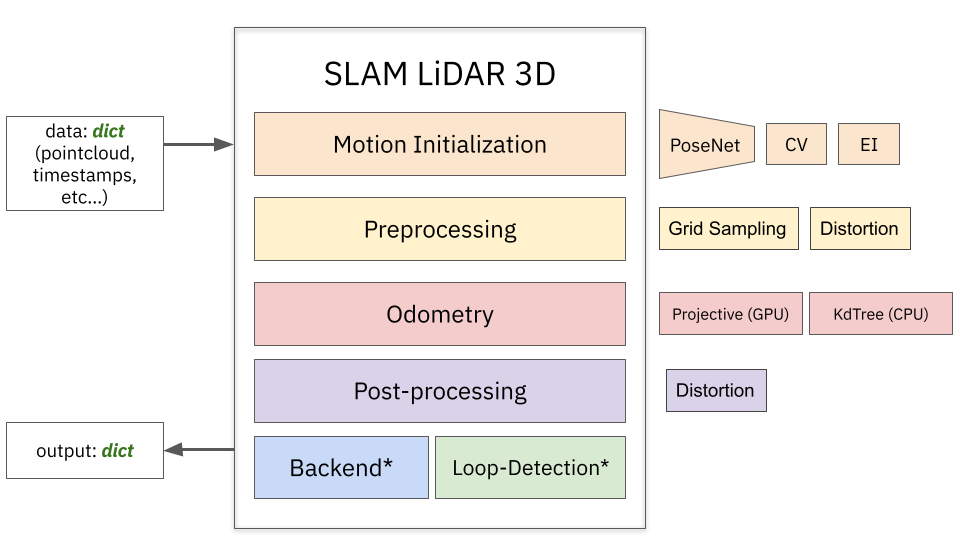
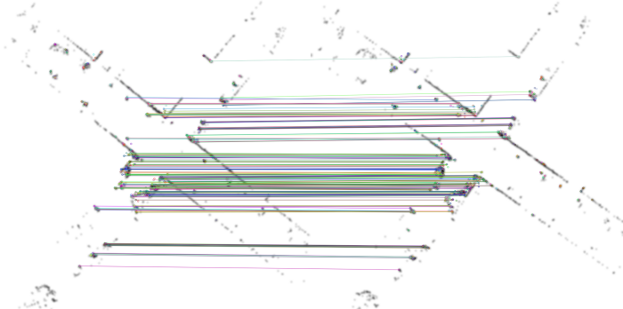

# SLAM LiDAR Toolbox



>This page describes in depth the content of the project. **pyLIDAR-SLAM** is designed as a modular toolbox of interchangeable pieces.
The basic structure of a **SLAM** algorithm is presented in the figure above.
For each component, multiple algorithms are implemented, (more will be added in the future). 

>Using Hydra, custom SLAM pipelines can be defined simply by modifying a command line argument. 
>Note that it leads to lengthy command lines (see the [benchmark](benchmark.md) to have an idea), but it is always possible to use pyLIDAR-SLAM as a library in your own scripts.


> A **SLAM** in this project processes data *frame-by-frame*. At each time step, the data is passed to the **SLAM** in a python dictionary.
>The key mappings are typically resolved using the configuration. See [slam.py](../slam/slam.py) for reference. 

> The script [`run.py`](../run.py) launches the **SLAM** specified by the configuration on a set of sequences of a given dataset see [dataset.md](datasets.md) for a list of the available datasets and how to install them. 

> Below, we review component by component all the modules implemented in **pyLIDAR-SLAM**.

# Motion Initialization

> The initialization of the motion is very important for LiDAR Odometries. Indeed, most lidar odometries rely on a variant of the ICP which has a very small convergence region.
> The strategies proposed are the following:
> - **CV** (for constant velocity): the motion estimated is the same as the previous motion between two frames.
> - **PoseNet**: the motion is predicted using a CNN based pose regression.
> - **EI** (for Elevation Images): the motion is predicted using a 2D image feature based registration.
> - **NI** (for No Initialization)

> To select the initialization module, pass in argument `slam/odometry/initialization=<init_name>` where `init_name` is one of `CV,EI,PoseNet,NI`.

> All initialization models can be found in [preprocessing.py](../slam/preprocessing/preprocessing.py).
#### Constant Velocity
> This model is typically the default model for a LiDAR mounted on a car (which has enough inertia for this model to hold).
> For other acquisition methods (hand-held or mounted on a segway or a drone which lead to abrupt rotations, this might not be a good enough model)

- **Command arguments**: `slam/odometry/initialization=CV`

#### Elevation Images
> The relative motion of a sensor is often strictly planar. Our **Elevation Images** based initializes the motion by estimating this 2D motion using Image Registration.
> Pointclouds are projected into elevation images. A 2D rotation and translation is robustly fitted, and is used to initialize the 3D motion. 



> Very useful for a dataset such as **NCLT** (which has abrupt *yaw* rotations)

> **Limits**:
> for this method to work, it requires that the sensor is mounted parallel to the ground on which the robot moves. It is also not robust to strong *pitch/roll* orientation changes. 

> **Note:** This method requires the OpenCV package `cv2` to be installed (e.g. via `pip install opencv-python`).
>
- **Command arguments**: `slam/odometry/initialization=EI` (to visualize the 2D alignments with opencv :`slam.odometry.initialization.debug=true`)

> See [`EIConfig`](../slam/preprocessing/preprocessing.py) and [`ElevationImageRegistration`](../slam/common/registration.py) for more details on the configuration options.

#### PoseNet

> **PoseNet** (for **RPR** (Relative Pose Regression) is a convolutional regressor predicting the 6 parameters of relative pose pose between two frames.

> The implementation can be found in [prediction_modules.py](../slam/training/prediction_modules.py). **PoseNet** needs to be trained on a Dataset (KITTI for instance). 
> The saved model will be loaded by the initialization algorithm which will regress at each step a relative pose between two consecutive frames.

> Follow the instruction below to launch the training of PoseNet:

 - Launch the train command (for example):
```bash 
export DATASET=kitti
export JOB_NAME=train_posenet
export KITTI_ODOM_ROOT=<path-to-kitti-odometry-root-directory>     # The path to KITTI odometry benchmark files
export TRAIN_DIR=<absolute-path-to-the-desired-train-dir>          # Path to the output models 

# Launches the Training of PoseNet
python train.py +device=cuda:0 +num_workers=4 +num_epochs=100 dataset=kitti
```
> Note: This will typically take a night for training on KITTI.
 - Define the environment variable `TRAIN_DIR` pointing to the directory containing the `checkpoint.ckp` file containing the trained model parameters.
```bash 
export DATASET=kitti
export JOB_NAME=slam_with_posenet
export KITTI_ODOM_ROOT=<path-to-kitti-odometry-root-directory>     # The path to KITTI odometry benchmark files
export TRAIN_DIR=<absolute-path-to-the-desired-train-dir>          # Path to the output models 

# Launches the Training of PoseNet
python run.py +device=cuda:0 +num_workers=4 dataset=kitti slam/odometry/initialization=PoseNet
```

> See our paper [What's In My LiDAR Odometry Toolbox](https://arxiv.org/abs/2103.09708) for an in depth discussion of the relevance/interest of PoseNet. To summarize: beware of its lack of generalization capacities.

# Preprocessing
> Preprocessing in pyLiDAR-SLAM is implemented as a set of filters. Each filter is applied consecutively to the input frame dictionary.

> The preprocessing modules currently implemented are:
> - **cv_distortion**: applies an initial distortion of the frame following the constant velocity assumption (uses timestamps and the initial pose predicted)
> - **voxelization**: voxelize a frame computes the voxel statistics mean/covariance
> - **grid_sampling**: select a point by voxel for a selected voxel size
> - **none** by default


> **Command argument**: `slam/odometry/preprocessing=<module name>`. See [preprocessing.py](../slam/preprocessing/preprocessing.py) for more details.

# Odometry 

> The different type of odometries accessible in **pyLIDAR-SLAM** are:
> - Classical ICP based **Frame-to-Model** odometry: (see [icp_odometry.py](../slam/odometry/icp_odometry.py))
> - Deep PoseNet based odometry: (see [posenet_odometry.py](../slam/odometry/posenet_odometry.py))

## Classical ICP based **Frame-to-Model** odometry

> The frame-to-model odometry estimates the relative pose of a new frame related to the previous registered pose.

> This is performed by registering the new frame against a **Model** which is typically a **Local Map** built from the previous registered frames.

> It will at each time step: 
 - Estimate the motion of the new frame as seen above
 - Preprocess the new frame as seen above
 - Register the new frame against the map (*ie* estimate the relative pose)
    - Search for neighbor points of the current frame in the map and their normals
    - Minimize an robust energy (typically a point)
 - Update the map
 - Log the pose and other values to the frame dictionary

#### Local Maps

>**pyLIDAR-SLAM** proposes the following implementations of a Local Map (all are implemented in [local_map.py](../slam/odometry/local_map.py)):

**1.** **kdtree** (cpu): 
>   At each time step the previous *n* pointclouds are transformed in the last inserted pose coordinate frame, 
>   and a kdtree is constructed on the aggregated pointcloud. Points of the new frame are queried against the newly formed kdtree. 
>   Note that the creation and querying of the **KdTree** is expensive, so consider sampling points to improve the speed.
>   Use `slam/odometry/local_map=kdtree` to select the kdtree.

**2.** **projective** (gpu):

> The previous *n* pointclouds are also transformed in the last inserted pose coordinate frame, but they are projected in 2D space using a spherical projection.
> This allows for projective data association which can be performed on the **GPU** using pytorch's cuda backend. To select this option use `slam/odometry/local_map=projective`.
> The projective local map uses the `Projector` defined by the dataset (which can be tweaked in the configuration). This method is probably not the most desirable for very sparse LiDARs as neighborhood are defined by shared pixel values. However for a Dataset such as KITTI they allow to build a SLAM in real-time (sacrificing a bit of precision).

>To select a **NVIDIA gpu** to perform projective alignment, select the appropriate device using the argument `device=cuda:0`.


#### Robust Alignment

> The ICP-based odometry proposes a robust **Point-to-Plane** alignment scheme. Each neighbor search leads to a set of point-to-plane residuals. 
> The minimization is performed by a gauss-newton. To improve the robustness to outliers the following robust loss function schemes can be selected in the configuration:
> - **least_square**: the default untruncated squared loss
> - **huber**
> - **geman_mcclure**
> - **cauchy**
> - **neighborhood**: weights residuals by the distance between neighbors (or the confidence that a match is good)

> To select a loss function select the following arguments `slam.odometry.alignment.gauss_newton_config.scheme=neighborhood,cauchy,etc..`

> More details can be found at [alignment.py](../slam/odometry/alignment.py).


# Loop Closure (*Under Development)


